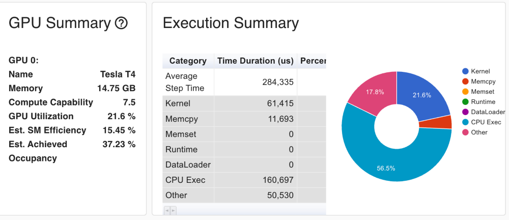
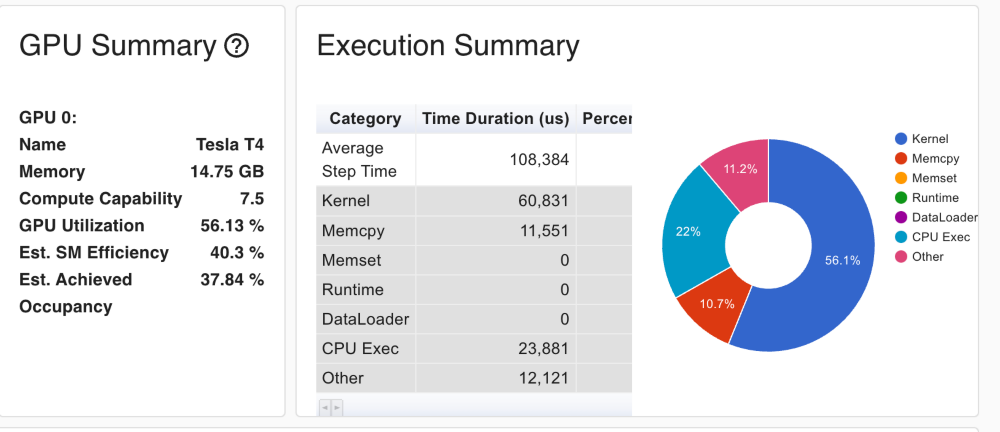

# Stock Volume Predictor

## Goal
Given historical financial data, predict the volume traded of a particular security
over the next x days. The model will trained on the history and will try to predict the average volume over the next month. The model uses a GRU to handle time series data and uses pytorch as the framework for ML. We chose to benchmark our model against the industry standard method of using the average of the previous month's volumes to predict the next month's volumes.

## How to use
You can use the below scripts in Input Datasets to generate any datasets that you need, you can then use Train.ipynb to follow along and reproduce the training process. The code is currently setup to integrate into google drive and run in Collab.

## Input datasets
1. history.csv - generated by pullHistorical.py, pulls historical stock data from yfinance API. Columns - Symbol,Date,Open,Close,High,Low,Volume,AdjClose
2. symbols.json - Contains list of symbols(stocks on NYSE and Nasdaq) we care about. Generated by pulldata.py
3. comp_info.csv - Contains metadata about the company. Generated by pulldata.py. Columns -symbol,country,currency,exchange,finnhubIndustry,marketCapitalization,name,shareOutstanding,ticker. Most important columns are most likely finnhubIndustry and marketCapitalization and sharesOutstanding
4. earnings.csv - Contains historical earnings info for the symbols. Specifically what dates they had earnings, and the reported vs expected earnings. Generated by getEarnings.py

## Training
Training process is defined in Train.ipynb

### Loading Data and Feature Generation
First step was to load data into pandas dataframes and then transform the data into appropriate ML features. Dates were turned into day, month, year, columns and the day and the month. Convert day of week and month of year into cyclical features for better training accuracy. Also add a column for if it is a us holiday. Convert the symbol to a number by labeling from 1 to N in order of average historical volume, this allows us to have meaning in the ordering of the symbol numbers. Also add columns for days to next earnings announcement. There were a lot of symbols that had missing market cap and shares outstanding data so we overode those with the mean for the entire dataset. 

### Break data into training and test sets
For this experiment we trained on data from 2018 and then used a test set, or seeing the first 11 months of 2019 and trying to predict the average volumes of December of 2019. Scale the data using SciKit learns Standard Scaler. We see that by plotting historgrams that the percentiles of the data are very non normal, this is a hard challenge for us. 

### Define Custom Pytorch Dataset and load into DataLoaders
Define custom pytorch dataset that groups into patches and does padding as not all symbols have data for all dates, so you end up with uneven input. Pytorch's pad_sequence works well for this.

### Define model
We use a GRU model with a custom loss function and custom activation function when using the model for predictions and not training. The custom loss function penalizes under predctictions which is a common problem in our model due to the scale of the data. The custom activation function prevents the model of predicting below zero in the scaled space. 

### Initial Predcitions 
Use initial "random" hyperparameters and acheived an r^2 value of .5 compared the baslines .93, not very good. 

#### Baseline results

#### Our model intial histogram

#### Original Predictions graph

### Weights and Biases
Used multiple iterations of W&B sweeps to help tune the hyperparameters. The first sweep was very broad with lots of different values for each hyperparameter. After the first sweep we got some idea at what worked well and then did multiple more passes to refine in a tighter window. Example of one our sweep runs

### Training with paramerters from W&B
Now that we had optimized our parameters we reran training and got a much more respectiple .835 r^2 value compared to the .5 that our model got orignially. Also the training loss decreased from .0796 to .0278. So a huge improvment due to weights and balances. 

## Profiling
Now that we had the model working we wanted it to run faster. Currently to train 150 epochs it was taking about 210 seonds. Looking at the inital profile we saw there was a huge CPU time cost. Diggint in we realized it was the custom loss funciton that we wrote, that was doing inneficient CPU processing and not vectorized operations that will use the GPU well. Also the time spent doing MemCopy was large then we hoped. This could be reduced by increasing the number of data loader workers. 

After doing the optimizations we saw training time go down 116 seconds, 1.81 times speedup. This also meant the GPUs were now being used much more effieciently. GPU utilization went from 21.6% to 56.13% upon making the improvements.

## Quantization

## Some notes on the many things we tried and failed on
There were many ideas we tried in the model building process that in theory could have helped but did work. These would include:
1. Trying to predict log volumes instead of volumes. This worked very well in the log space, in fact our model outperformed the baseline of the previous months volumes in terms of r^2. However when transforming back into the real space instead of the log space, the model underperformed.
2. Trying out different types of scales. We went through each type of scaler implement in SciKit learn, but none of them worked better than the Standard Scaler for this project. 
3. Adding in extra date features like 'Day of Year' and 'Day of Month'. Adding in these features caused our model to lose accuracy
4. Many different strategies for transforming Symbol into a number. This is a tricky problem as there are over 5K different symbols, so doing One Hot classification creates an enourmous amount of features. We tried out many different approaches for this, random numbers, Base 2 based feature columns

## Future Work
1. The biggest current flaw in the project is the scaling of the volume data and the amount of symbols that are being sent to zero because they are very tiny in the grand scheme of things. 
2. Implement distributed training to be able to train even faster then the 2 minutes of current trinaing time. 
